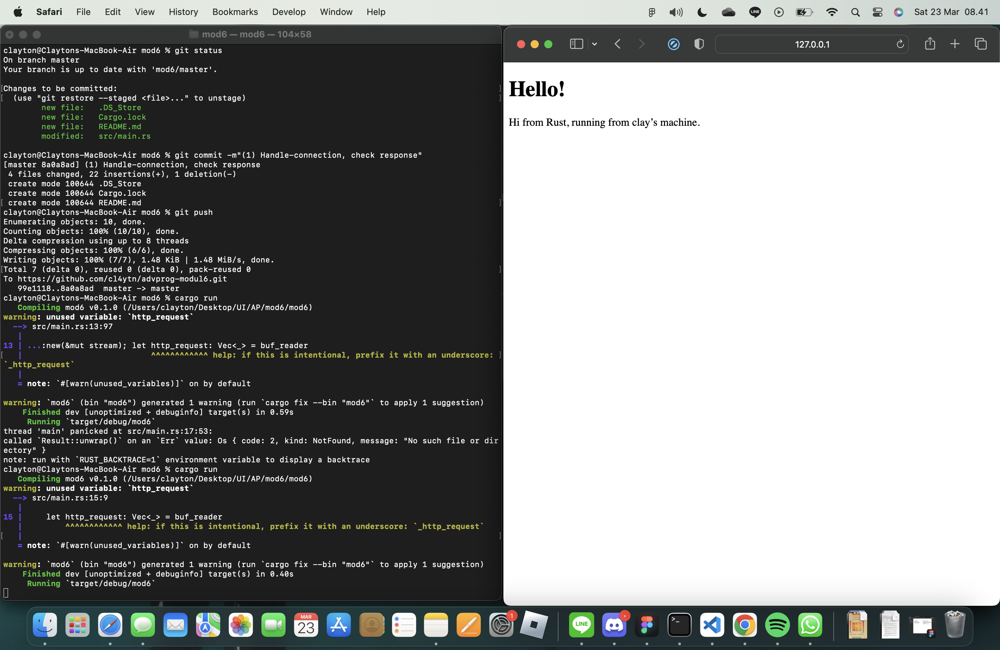

# Commit 1 Reflection Notes:
The handle_connection method reads HTTP requests from a Transmission Control Protocol (TCP) stream. A buffered reader `buf_reader` is instantiated to read lines from the stream. These lines are saved into a vector object called `http_request`. The method outputs the collected HTTP request lines.

# Commit 2 Reflection Notes:

`status_line` defines itself for the HTTP response. `contents` defines the body of the HTTP response. `length` gets the length of the contents. `reponse` constructs the response using `status_line`, `contents`, and `length`. `write_all()` writes the response back to the TCP stream.

# Commit 3 Reflection Notes:

Because we only need the first line of the HTTP request, we don't need to save all the lines into a vector object. Instead, we get the first line using `next`, and `unwrap` stops the iterator and handles the result. We check to see if the `request_line` is equal to the `/` path. If it is, we return the contents of hello.html, otherwise we return the contents of 404.html. The reason we refactor our first approach is because repetition. In both if and else blocks, we have the same code to return different file contents. Therefore, we instatiate two variables `status_line` and `file_name`. The values in these variables depend on if the `request_line` is equal to `GET / HTTP/1.1`. Using the same logic as before, we simply replace the hard coded status lines and file names with our new variables.

# Commit 4 Reflection Notes:
Now we use `match` because there are three cases: `/`, `/sleep`, and `/anything else`. "The first arm" has the same logic as our previous if statement. The second arm forces the program to sleep for 10 seconds before returning the contents of hello.html to simulate. The last arm has the same logic as the previous else statement. Its important to understand this concept because if we don't handle mulitple requests, our response times will be slow. To tackle this, we can implement thread pooling.

# Commit 5 Reflection Notes:
